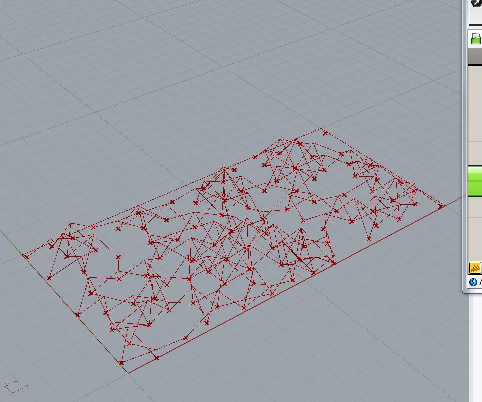

# atlv-ghPython  


[http://atlv.org/education/ghpython/](http://atlv.org/education/ghpython/)


---  


### index  

0. GH Python References & Resources  

1. GH Python Basics  

2. GH Python: Inputs // Tree Access  

3. GH Python: Function and Recursion  

4. GH Python: Baking and Object Attributes  

5. GH Python: Object-Oriented Programming  

6. GH Python: Connective Module  

7. GH Python: Custom Subdivisions  


---  

---  


### 0. GH Python References & Resources  

- RhinoPython 101 Primer  
  [http://www.rhino3d.com/download/IronPython/5.0/RhinoPython101](http://www.rhino3d.com/download/IronPython/5.0/RhinoPython101)  

- RhinoPython Reference  
  [http://4.rhino3d.com/5/ironpython/](http://4.rhino3d.com/5/ironpython/)  
  (In Rhinoceros menu) Tools > PythonScript > Edit  
  (In Rhino Python Editor menu) Help > Python Help  

- RhinoCommon Reference  
  [http://4.rhino3d.com/5/rhinocommon/](http://4.rhino3d.com/5/rhinocommon/)  


---  

### 1. GH Python Basics  

01-01 → 01-10  

  


---  


### 2. GH Python: Inputs  

02-01 → 02-12  
02-01 → 02-15  

ss-02-13_InputTree_1.ghx : DataTree（綺麗な UxV 個の配列）  
```Python
import rhinoscriptsyntax as rs

a=[]

for ptList in ptTree.Branches:
    for pt in ptList:

        circle = rs.AddCircle(pt,0.4)
        a.append(circle)
```

ss-02-14_InputTree_2.ghx : DataTree（綺麗な UxV 個の配列）  
```Python
# this iterates a tree of points and put circles
# input type: ptTree : Point3d (Tree Access)
import rhinoscriptsyntax as rs

a = []
for i in range(ptTree.BranchCount):

    ptList = ptTree.Branch(i)
    ptNum = len(ptList)

    for j in range(ptNum):

        if (i==10 and j==23 or i==20 and j==2 or i==32 and j==18):
            circle = rs.AddCircle(ptList[j], 5)

        else:
            circle = rs.AddCircle(ptList[j], 0.5)

        a.append(circle)
```


ss-02-15_InputTree_3.ghx : DataTree（配列の要素数がばらばら配列）  
```Python
import rhinoscriptsyntax as rs

a = []

for ptList in ptTree.Branches:
    for pt in ptList:
        minDist = -1 ##Initialize

        for ptList2 in ptTree.Branches:
            if (ptList != ptList2):

                for pt2 in ptList2:
                    dist = rs.Distance(pt,pt2)

                    if(minDist<0):
                        minDist = dist
                        closest = pt2
                    elif(dist<minDist):
                        minDist = dist
                        closest = pt2
        line = rs.AddLine(pt,closest)
        a.append(line)
```


  


---  


### 3. GH Python: Function and Recursion  

03-01 →　03-05  
03-01 →　03-10  

  


---  


### 4. GH Python: Baking and Object Attributes  

04-01 → 04-10  

  


---  

### 5. GH Python: Object-Oriented Programming  

05-01 →　05-08  

  


---  

### 6. GH Python: Connective Module  

06-01 → 06-07  

  


---  

### 7. GH Python: Custom Subdivisions  

07-01 → 07-24  
07-01 → 07-36  

  
