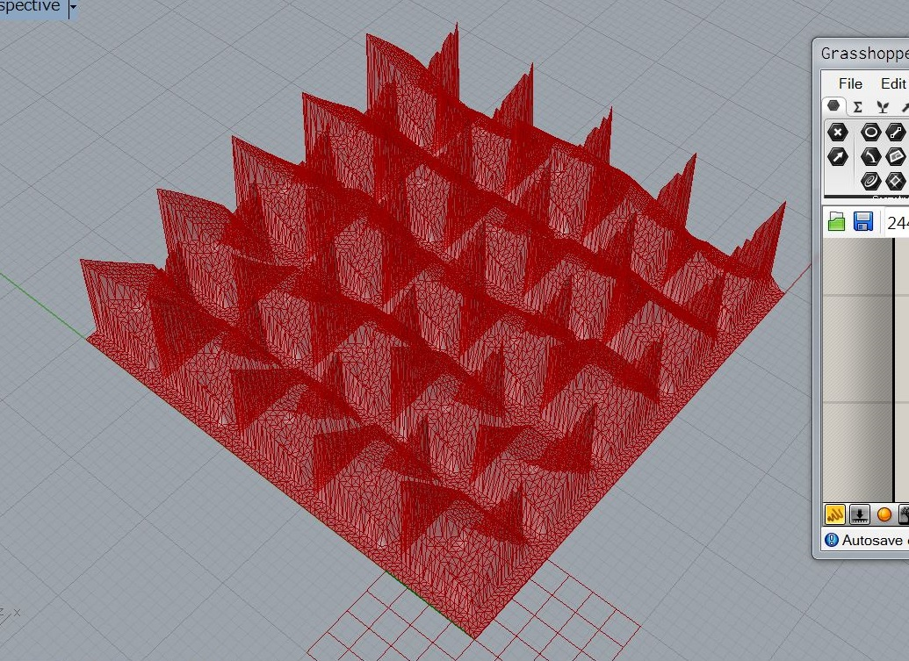

# atlv-ghPython  

[http://atlv.org/education/ghpython/](http://atlv.org/education/ghpython/)

---  

### index  

- 0. GH Python References & Resources  

- 1. GH Python Basics  

- 2. GH Python: Inputs  

- 3. GH Python: Function and Recursion  

- 4. GH Python: Baking and Object Attributes  

- 5. GH Python: Object-Oriented Programming  

- 6. GH Python: Connective Module  

- 7. GH Python: Custom Subdivisions  

---  

---  

### 0. GH Python References & Resources  

- RhinoPython 101 Primer  
  [http://www.rhino3d.com/download/IronPython/5.0/RhinoPython101](http://www.rhino3d.com/download/IronPython/5.0/RhinoPython101)  

- RhinoPython Reference  
  [http://4.rhino3d.com/5/ironpython/](http://4.rhino3d.com/5/ironpython/)  
  (In Rhinoceros menu) Tools > PythonScript > Edit  
  (In Rhino Python Editor menu) Help > Python Help  

- RhinoCommon Reference  
  [http://4.rhino3d.com/5/rhinocommon/](http://4.rhino3d.com/5/rhinocommon/)  

---  

### 1. GH Python Basics  

01-01 → 01-10  

  

---  

### 2. GH Python: Inputs  

02-01 → 02-12  
02-01 → 02-15  

  

---  

### 3. GH Python: Function and Recursion  

03-01 →　03-05  
03-01 →　03-10  

  

---  

### 4. GH Python: Baking and Object Attributes  

04-01 → 04-10  

  

---  

### 5. GH Python: Object-Oriented Programming  

05-01 →　05-08  

  

---  

### 6. GH Python: Connective Module  

06-01 → 06-07  

  

---  

### 7. GH Python: Custom Subdivisions  

07-01 → 07-24  
07-01 → 07-36  

  
