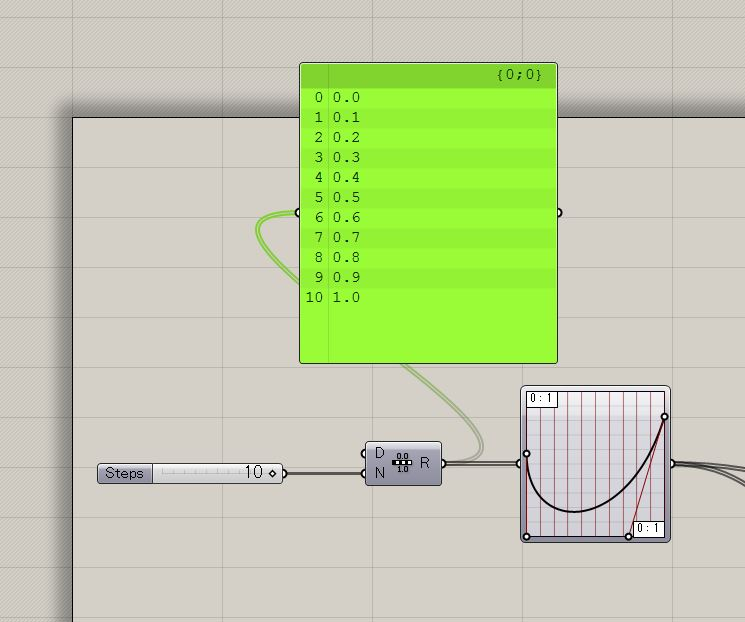

# Study-Grasshopper  

ゼロから書き直したほうが良いのもある。  

もう少し実用的なのはこっちに。  
[http://naysok.org/GH/](http://naysok.org/GH/)

---  

### index  

- 5 // Rhino 5 + Grasshopper 0.9.0076  

  - atlv-ghPython // [http://atlv.org/education/ghpython/](http://atlv.org/education/ghpython/)  

  - BoxMorph-01.ghx // SurfaceBox, BoxMorph  

  - Chair.ghx  

  - Cocoon-MetaBall.ghx // CocoonPointCharge, Refine

  - FabCafe-classA-1.ghx  

  - FabCafe-classA-Homework-example.ghx // TrimWithRegion  

  - FabCafe-classB-1.ghx // Attractor  

  - FabCafe-classB-2.ghx // Attractor  

  - FabCafe-classC-1.ghx   

  - FabCafe-classC-2.ghx   

  - FabCafe-classE-1.ghx // python basic  

  - FabCafe-classE-2.ghx // ghPython basic  

  - FabCafe-classE-3.ghx  

  - Font-Wave.ghx  

  - Galapagos-01.ghx  

  - ghPython-Array-01.ghx // ghPython for loop  

  - GH-vs-Python-vs-Cs-01.ghx  

  - GrasshopperBake-with-ghPython.ghx // ghPython  

  - Group-01.jpg // Group  

  - ImageSampler.ghx // imageSampler  

  - ImageSampler-02.ghx // imageSampler  

  - ImageSampler-03.ghx // imageSampler  

  - ImageSampler-04.ghx // imageSampler  

  - Line-Reconstruction.ghx  

  - Line-to-Bricks.ghx  

  - Make-Script-RhinoPy-iGeo-p5.ghx  

  - Mesh-Reconstruction.ghx  

  - Pattern-Circle-01.ghx  

  - Pattern-Ellipse-01.ghx  

  - Pattern-Honeycomb-01.ghx  

  - Pattern-Pen-Sakis-01.ghx  

  - Pattern-T-01.ghx  

  - Perlin-Slimplex-Noise.ghx // Periln(py), SimplexNoise  

  - Thonet-Chair.ghx  

  - Timer.ghx  

  - Twisted-Column.ghx  

  - Voronoi-Sphere.ghx // FacetDome, WbFrame, wbThicken  

---

### Memo

##### Range-GraphMapper  

  

---  

### Links  

- FabCafe Youtube（[https://www.youtube.com/watch?v=BiNDLj7BhwU&feature=youtu.be](https://www.youtube.com/watch?v=BiNDLj7BhwU&feature=youtu.be)）  

- Grasshopper Components Reference （[https://rhino.github.io/](https://rhino.github.io/)）

---  
