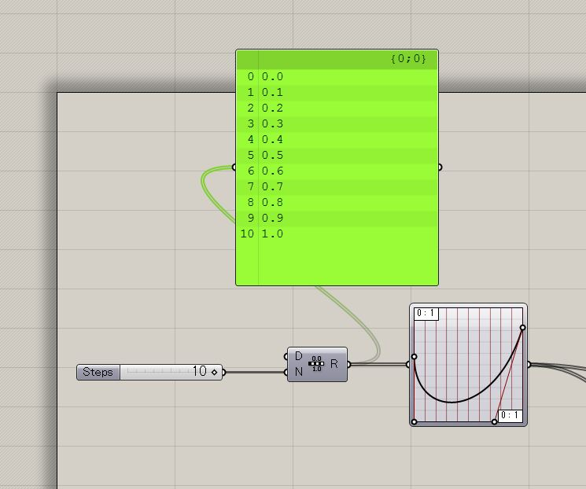

# Study-Grasshopper  

ゼロから書き直したほうが良いのもある。  

---  

### index  

- BoxMorph-01.ghx // SurfaceBox, BoxMorph  

- Chair.ghx  

- FabCafe-classA-1.ghx  
- FabCafe-classA-Homework-example.ghx // TrimWithRegion  
- FabCafe-classB-1.ghx // Attractor  
- FabCafe-classB-2.ghx // Attractor  
- FabCafe-ClassC-1.ghx   
- FabCafe-ClassC-2.ghx   
- FabCafe-ClassE-1.ghx // python basic  
- FabCafe-ClassE-2.ghx // ghPython basic  
- FabCafe-ClassE-3.ghx  

- Font-Wave.jpg  

- GH-vs-Python-vs-Cs-01.ghx  

- GrasshopperBake-with-ghPython.ghx // ghPython  

- imageSampler.ghx // imageSampler  
- imageSampler-02.ghx // imageSampler  
- imageSampler-03.ghx // imageSampler  
- imageSampler-04.ghx // imageSampler  

- Line-Reconstruction.ghx  

- Line-to-Bricks.ghx  

- Make-Script-RhinoPy-iGeo-p5.ghx  

- Mesh-Reconstruction.ghx  

- Pattern-Circle-01.ghx  
- Pattern-Ellipse-01.ghx  
- Pattern-Honeycomb-01.ghx  
- Pattern-Pen-Sakis-01.ghx  
- Pattern-T-01.ghx  

- Perlin-Slimplex-Noise.ghx // Periln(py), SimplexNoise  

- Thonet-Chair.ghx  

- Timer.ghx  

- Twisted-Column.ghx  

- Voronoi-Sphere.ghx // FacetDome, WbFrame, wbThicken  

---

### Memo

##### Range-GraphMapper  

  

---  

### Links  

- FabCafe Youtube（[https://www.youtube.com/watch?v=BiNDLj7BhwU&feature=youtu.be](https://www.youtube.com/watch?v=BiNDLj7BhwU&feature=youtu.be)）  

- Grasshopper Components Reference （[https://rhino.github.io/](https://rhino.github.io/)）

---  
